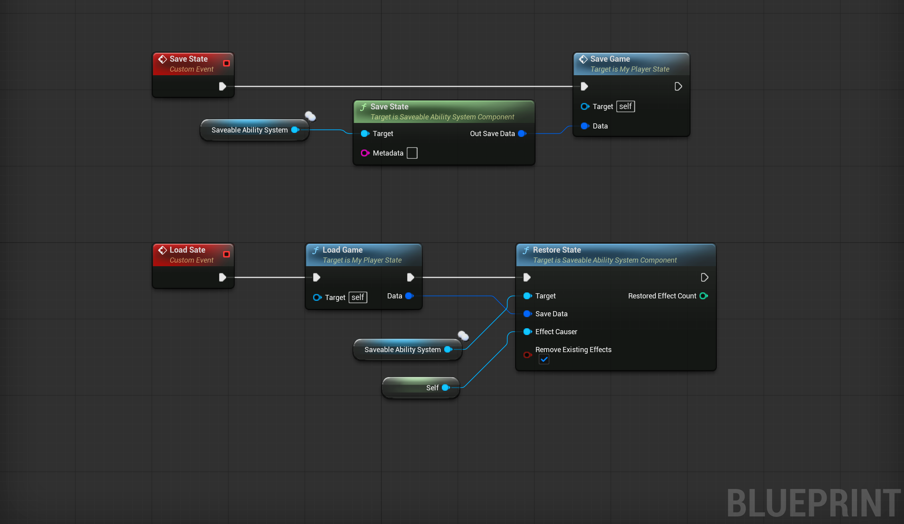

# SavableGAS

SavableGAS provides a UAbilitySystemComponent subclass that can snapshot active duration Gameplay Effects (including periodic timing state) into a portable struct and restore them later. Intended to work with any save game system.

Supports saving attributes and gameplay effects, including eliminating possible double application. Only `Has Duration` effects (including those with infinite duration) are saved, because instant and infinite are assumed to be applied by the game logic.

## Installation and Usage

1. Install the plugin in your project Plugins folder.
2. Replace `UAbilitySystemComponent` you use with `USavableAbilitySystemComponent`.
3. In order to save whole state call `SaveState()` on `USavableAbilitySystemComponent` which populates a `FAbilitySystemSaveData` struct. This is possible via c++ or Blueprint.
4. Save this struct in a save game system of your chosing (https://github.com/sinbad/SPUD recommended).
5. To restore, pass the previously saved struct to the `RestoreState()` method of `USavableAbilitySystemComponent`. This, too, is possible via c++ or Blueprint.

