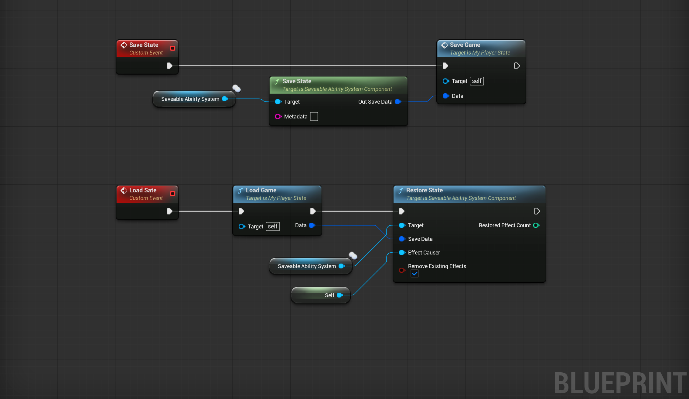

# SavableGAS

SavableGAS provides a UAbilitySystemComponent subclass that can snapshot active duration Gameplay Effects (including periodic timing state) into a portable struct and restore them later. Intended to work with any save game system.

Supports saving attributes and gameplay effects, including eliminating possible double application. By default only `Has Duration` effects are saved, because instant and infinite effects are assumed to be applied by the game logic.

Infinite effects can be saved as well, using `InfiniteEffectSaving` on the component:

- `None` (default) - infinite effects are not saved.
- `Selected` - only effects listed in `SavedInfiniteEffects` (including subclasses) are saved.
- `All` - all infinite effects are saved. Don't use it if your game logic applies infinite effects after `RestoreState()`, as they will get duplicated.

When a save contains infinite effects, restoring it replaces the matching effects already on the component, so they can safely be applied on startup before restoring. Saves made without them leave existing infinite effects untouched.

## Installation and Usage

1. Install the plugin in your project Plugins folder.
2. Replace `UAbilitySystemComponent` you use with `USavableAbilitySystemComponent`.
3. In order to save whole state call `SaveState()` on `USavableAbilitySystemComponent` which populates a `FAbilitySystemSaveData` struct. This is possible via c++ or Blueprint.
4. Save this struct in a save game system of your choosing (https://github.com/sinbad/SPUD recommended).
5. To restore, pass the previously saved struct to the `RestoreState()` method of `USavableAbilitySystemComponent`. This, too, is possible via c++ or Blueprint.

